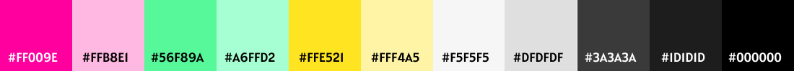

   

## LabFriends é uma rede social para alunas do bootcamp da Laboratoria.

**Status do Projeto:** _Concluído_ 
   
** Previsto possíveis modificações para o site **
  
**Deploy:** [Rede Social LabFriends](https://adrianatwatanabe.github.io/SAP007-social-network/)
   

  
  
  
  

---

## ÍNDICE

- [1. INTRODUÇÃO](#1-introdução)
- [2. HISTÓRIAS DE USUÁRIOS](#2-histórias-de-usuários)
  - [2.1. Critérios de Aceitação do Produto](#21-critérios-de-aceitação-do-produto)
  - [2.2. Definição de Pronto do Produto](#22-definição-de-pronto-do-produto)
- [3. PROTÓTIPOS](#3-protótipos)
  - [3.1. UX (Experiência do Usuário) e UI (Design de Interface)](#31-ux-experiência-do-usuário-e-ui-design-de-interface)
- [4. PROTÓTIPOS](#4-protótipos)
  - [4.1. Protótipo de Baixa Fidelidade](#41-protótipo-de-baixa-fidelidade)
  - [4.2. Protótipos de Alta Fidelidade](#42-protótipos-de-alta-fidelidade)
- [5. TESTES DE USABILIDADE](#5-testes-de-usabilidade)
- [6. AUTORAS](#6-autoras)

---
   
## 1. INTRODUÇÃO
   
LabFriends é uma rede social interna destinada para todas alunas e ex-alunas do bootcamp da _*[Laboratoria](https://www.laboratoria.la/br)*_, com objetivo de mantê-las conectadas, mesmo após o término do bootcamp, além de ampliar a sua rede de contato profissional. 

Todas as usuárias terão um perfil editável, com informações pessoais relacionados a área de programação e também poderão criar, editar e excluir suas postagens visualizadas em sua linha do tempo (timeline), além de comentar e curtir posts das demais usuárias. Por fim, a LabFriends contará com uma área específica, onde trará uma lista contendo: o seu nome social, a sua foto e uma breve descrição de sua vida pessoal e profissional, podendo encontrar uma usuária específica por meio da pesquisa com seu nome.

O diferencial dessa rede social é que todas as mulheres que se cadastrarem, serão automaticamente conectadas com as demais existentes na LabFriends, não havendo necessidade de encontrar usuárias individualmente para solicitar a sua amizade online. Assim, todas as usuárias poderão se conectar com maior número de alunas,  para buscar informações pertinentes enquanto as mesmas estão cursando o bootcamp e até mesmo para dúvidas profissionais após o seu término.

## 2. HISTÓRIAS DE USUÁRIOS

> "Como amante de rede social e aluna da Laboratoria quero uma rede social para que eu possa conectar com as minhas colegas da Lab, fora do horário do bootcamp. Desejo ter mais momentos de [happy hour](https://pt.wikipedia.org/wiki/Happy_hour) com elas e também poder tirar dúvidas sobre programação ou ajudar as minhas colegas. Quero uma aplicação que eu possa acessar em qualquer dispositivo, desde celular, tablet e notebook e que eu possa clicar em qualquer parte do site para criar as minhas postagens."

> "Eu, como aluna da Lab (Laboratoria), desejo manter contato com as minhas colegas de bootcamp e também as demais de outras turmas formadas anteriormente, para tirar dúvidas sobre a carreira de programação e também de assuntos do próprio bootcamp. Também quero para ter momentos de entretenimento com as minhas colegas fora do horário do bootcamp."

### 2.1. CRITÉRIOS DE ACEITAÇÃO DO PRODUTO

   - Permitir que somente as alunas e ex-alunas da Laboratoria façam parte da LabFriends, portanto, é necessário criar uma conta para acessar a parte interna do site LabFriends.
 
   - Todas as usuárias devem ter todos os seus dados salvos no site e mesmo saindo dele, as informações devem persistirem para que outras usuárias possam visualizar essas informações em qualquer hora.

   - Permitir que o perfil de cada usuária seja editável, ou seja, a própria usuária que entrou em sua conta poderá ir em seu perfil e editar as suas informações pessoais e de postagens. 

   - Somente a usuária que entrou com a sua conta criada, poderá criar uma postagem, editar, apagar as suas próprias postagens. 

   - No entanto, somente a própria usuária poderá editar as suas informações pessoais, isso inclui a edição de perfil e eventuais alterações nas postagens, quando a mesma estiver usando a conta que foi criada e essa mesma conta for a conta que criou o perfil/post escolhido para editar.

   - Para as demais funções do site, como comentar e curtir, são destinados a todas usuárias, isso incluir a própria usuária curtir e/ou comentar as suas postagens e postagens de terceiros.

### 2.2. DEFINIÇÃO DE PRONTO DO PRODUTO

   - [x] O site LabFriends deve ser uma [_*SPA*_ (Single-page Application)](https://pt.wikipedia.org/wiki/Aplicativo_de_p%C3%A1gina_%C3%BAnica),ou seja, o site deve reescrever dinamicamente a página da Web atual com novos dados do servidor da Web, em vez alterar as informações da tela por meio da atualização da página.
 
   - [x] O site deve ser responsivo, podendo ser acessado por smartphone, tablet, notebook e desktop, adequando o conteúdo da tela para o tamanho relativo do dispositivo que está acessando-o. As principais modificações são os tamanhos de letras, ícones e imagens, de espaçamentos e disposição do gráfica dos elementos.

   - [x] Para qualquer erro de acesso encontrado pelo usuário, deve ser informado na tela com uma explicação do erro que está ocorrendo. Se o usuário persistir no erro, este erro deve permanecer na tela. Já para erros diferentes, a mensagem do erro na tela deve mudar para o usuário.

   - [x] Para ações dos usuários que ocorreram sucesso, deve ser mostrados na tela automaticamente a ação em que o usuário pretendia que acontecesse, não precisando que ele atualize a página para que a ação seja visualizada.

   - [x] Para acessar todas as páginas internas do site LabFriends, a usuária deve estar cadastrada seja com email e a senha que ela usou para criar a conta pertecente e, após isso, realizar o acesso ao site com essas mesmas informações. Caso a usuária não queira criar uma conta nova, haverá a possibilidade de usar a sua conta do Google, e, neste caso, o site LabFriends não terá acesso a sua senha ou qualquer meio de autenticação da conta do Google.
   
## 3.  UX (EXPERIÊNCIA DO USUÁRIO) E UI (DESIGN DE INTERFACE)
   
### _**3.1 DESIGN DO SITE**_

  - A aplicação será baseada no estilo, tipografia e cores pertencentes ao design da Laboratoria. O estilo aplicado é o _**[flat design](https://www.chiefofdesign.com.br/ui-design/)**_, reduzido em formas planas, sem sombreamento, sem texturas e reflexos, sendo focado nos conteúdos e em uma navegação mais simples em linhas retas.

### _**3.2 PÁGINAS DO SITE**_

  - A estrutura do site seguirá usando o conceito de SPA [(Single Page Application)](https://pt.wikipedia.org/wiki/Aplicativo_de_p%C3%A1gina_%C3%BAnica), obedecendo a seguinte estrutura do site:
  
  #### **3.2.1 SEM AUTENTICAÇÃO DE USUÁRIA:**

   1. _**PÁGINA INICIAL**_: 
       - Está página mostrar as informações para o usuário realizar a sua autenticação para acessar a parte interna do site LabFriends. 
       - As autenticações são de email e senha usando a conta criada na LabFriends e/ou usando a conta do Google. 
       - É possível redefinir a senha da conta criada na LabFriends, enviando um email da conta cadastrada. 
       - Há um link para criar uma nova conta na LabFriends.
    
   2. _**PÁGINA DE CADASTRO**_:
       - Na página de cadastro, existe um formulário que deve ser preeenchido com nome social, email existente, senha e a repetição desta senha. 
       - Após o preenchido é possível enviar este dado para criar uma nova conta na LabFriends. 
       - Caso seja realizado, entrará automaticamente em sua página de todas as postagens do site (PÁGINA FEED). 
       - Caso a usuária desista de criar uma nova conta, é possível voltar para a tela inicial.

  #### **3.2.2 COM AUTENTICAÇÃO DE USUÁRIA:**
    
   1. _**PÁGINA DE FEED**_:
       - Nessa página encontra-se todas postagens de todas as usuárias da LabFriends.
       - Está ordenado por ordem de mais atual, sendo visualizado primeiro ao entrar nesta página.
       - A usuária autenticada com sua conta e que criou uma postagem na sua conta, é possível editar e excluir essa postagem.
       - Todas usuárias nessa página poderão comentar e curtir as suas próprias postagens e as das demais usuárias.
       
   2. _**PÁGINA DE NOVA POSTAGEM**_:
       - Esta página é sobreposta sobre as demais páginas internas, sendo acessível (assim como as demais) pelo cabeçalho do site.
       - Após criar uma nova postagem, é possível visualizá-la na página FEED e PERFIL DE USUÁRIA.

   3. _**PÁGINA DE LISTA DE USUÁRIAS [EM CONSTRUÇÃO]**_:
       - Todas as usuárias estarão nessa página e inclusive as suas informações referentes a: seu nome social, seu email, as linguagens e metodologias que a mesma "domina" e no que ela trabalha atualmente.
       - Esta página é destinada a visualizar uma breve informação de cada usuária que criou uma conta com email e senha na LabFriends ou acessou com a conta do Google.
       - É possível pesquisar uma usuária específica pelo seu nome social.

   4. _**PÁGINA DE MEU PERFIL**_:
       - A usuária autenticada poderá visualizar todas as suas postagens criadas referentes a conta autenticada.
       - Em cada postagem dessa página, a usuária poderá editar, excluir, comentar ou curtir a sua própria postagem.
       - O diferencial dessa página com a do FEDD, é que ela trás informações somente da dona da conta, o que inclui as informações pessoais encontradas na página LISTA DE USUÁRIAS e a sua breve descrição.
     
### _**3.3 RESPONSIVIDADE DO SITE**_

   - Os tamanhos de telas utilizados no site, foram escolhidos segundo as estatísticas encontradas no site Statcounter, com base em dados coletados mundialmente. Os aparelhos eletrônicos escolhidos foram: [smartphone](https://pt.wikipedia.org/wiki/Smartphone), [tablet](https://pt.wikipedia.org/wiki/Tablet) e [desktop](https://en.wikipedia.org/wiki/Desktop_computer), que são:

         - Smartphone na posição vertical: 360 x 640 pixels
         - Tablet na posição vertical: 600 x 962 pixels
         - Desktop na posição horizontal: 1280 x 720 pixels

  - Para utilizarmos no site essas medidas de pixels, nos baseamos na mudança de orientação da tela e na opção ativada de rotacionamento da mesma. Com isso, possuímos diferentes largura e alturas, porém o site se adequará somente a largura visível da tela. Com base em tudo isso, concluímos que os intervalos melhores para mudar os tamanhos de letras, espaçamentos, ícones, além da disposição dos elementos na página será de:

         - De 300px a 550px de largura: possíveis intervalos para tamanhos de smartphones;
         - De 550px a 1000px de largura: possíveis intervalos para tamanhos de tablets;
         - De 1000px a 1800px de largura: possíveis intervalos para tamanhos de notebooks/desktops;
         - De 1800px a 2600px de largura: possíveis intervalos para tamanhos de desktops;

### _**3.4 TIPOGRAFIA E HIERARQUIA**_

  - A [tipografia](https://www.chiefofdesign.com.br/tipografia/) escolhida possui fonte sem serifa, com a font-family: Arial, Verdana, Helvetica e Sans-Serif. São letras fáceis de serem visualizadas e lidas em aplicações da web. Para frases em destaque, serão usadas fonte com serifa, como: Times New Roman, Georgia e Garamond.

   - Para visualizar a hierarquia, foi usado fontes grandes para títulos de páginas. Já para destacar mais de um título em uma mesma página, o tamanho das letras serão padronizadas conforme o assunto abordado em seu conteúdo. Por fim, os demais textos, obedecem a hierarquia em relação ao título da página e ao tipo de tela em que será exibido.

### _**3.5 CORES E CONSTRASTES**_

  - As cores em destaque serão feitas pelas cores: rosa, amarelo e verde, usados para detalhes como em botões, títulos e outros detalhes de destaque. Já as cores neutras, como: cinza, branco e preto, são usados para planos de fundo e letras, pois, facilita o contraste para a leitura em telas.

     

        
     

## 4. PROTÓTIPOS

- Para o desenvolvimento do protótipo de alta fidelidade, foi usado uma ferramenta digital para protótipo. A ferramenta utilizada foi o [Figma](https://www.figma.com/), que é um editor gráfico de vetor e prototipagem de projetos de design baseado principalmente no navegador web.

### 4.1. PROTÓTIPO DE BAIXA FIDELIDADE

- O protótipo de baixa fidelidade serve para demonstrar e organizar as ideias de como os elementos estarão na página em um projeto inicial. É possíve identificar alguns problemas de usabilidade, testando conceitos e descobrindo o valor que o produto final pode gerar aos seus clientes. A seguir, estará o protótipo de baixa fidelidade do site da LabFriends.

- Para este projeto aplicamos o termo MOBILE FIRST que trata-se de qualquer projeto web que leve em consideração a usabilidade em dispositivos móveis primeiro. Portanto, desde o design até o desenvolvimento das funcionalidades, tudo é pensado para o mobile e depois adaptado para o desktop.

   

      
   

### 4.2. PROTÓTIPOS DE ALTA FIDELIDADE

- Já o protótipo de alta fidelidade é uma representação interativa do produto, baseada no computador ou em dispositivos móveis. Esse protótipo já apresenta maior semelhança com o design final em termos de detalhes e funcionalidade.

   #### 4.2.1 Protótipo para telas com largura entre 300 pixels a 550 pixels
   
     

        
     

   #### 4.2.2. Protótipo para telas com largura entre 550 pixels a 1.000 pixels

     

        
     

   #### 4.2.3. Protótipo para telas com largura acima de 1.000 pixels

     

        
     

## 5. TESTES DE USABILIDADE

## 6. AUTORAS

<table>
<td>
  

     
  

  <h3 align="center"><a href="https://github.com/adrianatwatanabe">Adriana Tiemi Watanabe</a></h3>
  <h4 align="center">Projeto do Bootcamp da <em><a href="https://hub.laboratoria.la/br">Laboratoria</a></em></h4>
  

    
    
  

</td>

<td>
  

     
  

  <h3 align="center"><a href="https://github.com/Maryssun">Dayanne Maryssol de Andrade Almeida</a></h3>
  <h4 align="center">Projeto do Bootcamp da <em><a href="https://hub.laboratoria.la/br">Laboratoria</a></em></h4>
  

    
  

</td>

<td>
    

     
  

  <h3 align="center"><a href="https://github.com/RaynaraPimenta">Raynara Pimenta</a></h3>
  <h4 align="center">Projeto do Bootcamp da <em><a href="https://hub.laboratoria.la/br">Laboratoria</a></em></h4>
  

    
    
  

   
</td>

</table>
